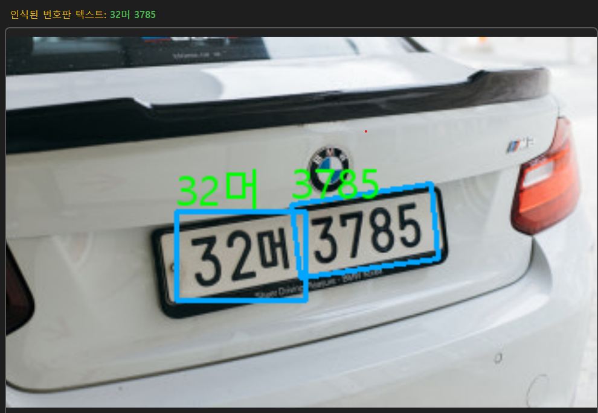

# 🚗 차량 번호판 OCR 분석기 (EasyOCR 기반)

> 💡 **ANPR (Automatic Number Plate Recognition) Solution Proof of Concept using EasyOCR and PyQt5**

[](https://www.python.org/)
[](https://opensource.org/licenses/MIT)
[](https://github.com/hdy5049/image)

---

## 📋 목차

1.  [✨ 주요 특징](#-주요-특징)
2.  [🚀 데모 및 시연](#-데모-및-시연)
3.  [🛠️ 설치 및 실행 방법](#-설치-및-실행-방법)
4.  [⚙️ OCR 파이프라인 (작동 방식)](#-ocr-파이프라인-작동-방식)
5.  [🛑 성능 한계 및 향후 개선 방안](#-성능-한계-및-향후-개선-방안)

---

## 1. ✨ 주요 특징

* **GUI 기반**: PyQt5를 사용하여 사용자 친화적인 데스크톱 애플리케이션 형태를 제공합니다.
* **미디어 지원**: 단일 이미지 파일 및 동영상 파일 (*.mp4, *.avi 등*)을 불러와 분석합니다.
* **고급 이미지 전처리**: OpenCV의 **CLAHE(대비 균등화)** 및 **모폴로지 연산**을 적용하여 번호판 텍스트의 윤곽을 최대한 강조, 인식률을 향상시킵니다.
* **시각화**: 인식된 텍스트 영역에 박스를 그리고, PIL을 이용해 한글 텍스트를 이미지에 오버레이하여 표시합니다.
* **안정성 강화**: 라이브러리 로드 실패 시 비정상 종료를 방지하는 안전 코드가 적용되었습니다.

---

## 2. 🚀 데모 및 시연

### 2.1. 분석 결과 스크린샷

프로그램이 단일 이미지에서 번호판 영역을 성공적으로 탐지하고 텍스트를 인식하는 모습입니다.

| 이미지 분석 결과 (BMW 차량) |
| :---: |
|  |

### 2.2. 시연 영상

동영상 스트리밍 환경에서의 실시간 인식 및 동작을 유튜브를 통해 확인할 수 있습니다.

[](https://youtu.be/r4EacXMPezw?si=7SflqmIkPkOZFMvn)

---

## 3. 🛠️ 설치 및 실행 방법

### 3.1. 환경 설정

Anaconda/Miniconda를 사용하는 경우, 가상 환경을 생성하고 활성화하는 것을 권장합니다.


# 가상 환경 생성

conda create -n anpr_env python=3.9

# 가상 환경 활성화

conda activate anpr_env

### 3.2. 종속성 설치프로그램 실행에 필요한 모든 라이브러리를 설치합니다.

Bashpip install PyQt5 opencv-python easyocr numpy Pillow

### 3.3. 실행다운로드 받은 파이썬 스크립트(pro.py 등)를 실행합니다.

Bashpython pro.py

### 3.4. 사용법

프로그램 실행 후, 다음과 같이 파일을 선택하고 분석을 진행합니다.

* "📸 이미지 열기" 또는 "▶️ 동영상 열기" 버튼을 클릭하여 파일을 선택합니다.
* 동영상 분석 시, 프레임 속도에 맞춰 OCR이 실시간으로 진행됩니다.

---

## 4. ⚙️ OCR 파이프라인 (작동 방식)

이 프로그램은 EasyOCR의 내장 기능만 사용하는 **단일 단계(One-Stage) OCR** 방식을 채택하고 있으며, 영상 품질을 극대화하는 데 중점을 둡니다.

### 4.1. 전처리 과정 상세

번호판 인식률을 높이기 위해 다음의 순차적인 전처리가 모든 프레임에 적용됩니다.

| 단계 | 역할 | `cv2` 함수 |
| :---: | :--- | :--- |
| **Grayscale** | 연산 단순화 | `cv2.cvtColor` |
| **CLAHE** | 저조도/그림자 환경 대비 개선 | `cv2.createCLAHE` |
| **이진화 (Threshold)** | 텍스트와 배경을 흑백으로 분리 | `cv2.THRESH_OTSU` |
| **Morphology** | 텍스트의 끊김을 메우고 윤곽 보강 | `cv2.morphologyEx` |

### 4.2. OCR 설정

EasyOCR은 한국어와 영어 모델을 모두 사용하며, 낮은 품질의 텍스트도 탐지하기 위해 민감도가 공격적으로 조정되어 있습니다.

| 설정 | 값 | 의미 |
| :---: | :---: | :--- |
| **언어 모델** | `['ko', 'en']` | 한국어 및 영문 텍스트 인식 시도 |
| **`gpu`** | `False` | CPU 연산 강제 (대부분의 환경에서 구동 보장) |

---

## 5. 🧑‍💻 핵심 코드 분석

본 프로그램의 주요 기능은 다음과 같은 핵심 함수로 구현되었습니다.

## 5. 🧑‍💻 핵심 코드 분석

본 프로그램의 주요 기능은 다음과 같은 핵심 함수로 구현되었습니다.

### 5.1. 한글 출력 및 시각화 (`put_korean_text`)


OpenCV에서 직접 지원하기 어려운 한글 폰트 출력을 위해 PIL(Pillow) 라이브러리를 활용합니다. 이 함수는 인식된 결과에 한글을 정확히 표시하는 역할을 담당합니다.

```

def put_korean_text(img, text, pos, font_path, font_size, color=(0, 255, 0)):

    # 1. OpenCV 이미지를 PIL 이미지로 변환
    img_pil = Image.fromarray(cv2.cvtColor(img, cv2.COLOR_BGR2RGB))
    
    # ... (중략: 폰트 로드 및 텍스트 출력)
    
    # 2. PIL 이미지를 다시 OpenCV 이미지로 변환 및 반환
    return cv2.cvtColor(np.array(img_pil), cv2.COLOR_RGB2BGR)
 
 
---
```

### 5.2. OCR 처리 로직 (process_frame)
실제 프레임을 입력받아 EasyOCR을 실행하고, 결과를 bounding box 및 텍스트로 시각화하는 핵심 파이프라인입니다.

```
def process_frame(frame):
    if frame is None or reader is None:
        return None, "EasyOCR 로드 오류"
        
    # EasyOCR 실행
    vis_results = reader.readtext(frame, detail=1, paragraph=False)
    
    # 2. 결과 반복문 처리
    for (bbox, text, conf) in vis_results:
        # 박스 그리기 및 한글 텍스트 오버레이 (put_korean_text 호출)
        # ...
        
    return vis_frame, full_text
```

## 6. 🛑 성능 한계 및 향후 개선 방안

### 6.1. 현재 솔루션의 한계

현재 프로그램은 EasyOCR의 범용 텍스트 탐지 기능에 의존하기 때문에 다음과 같은 경우에 성능이 저하됩니다.

* **번호판 외 텍스트 오인식**: 주변의 간판, 로고 등 불필요한 텍스트를 번호판으로 오인식할 가능성이 높습니다.
* **모션 블러(Motion Blur)**: 고속 주행 차량의 경우, EasyOCR의 탐지 정확도가 급격히 떨어집니다.

### 6.2. 전문화를 위한 개선 로드맵

인식률과 속도를 비약적으로 향상시키기 위해서는 다음과 같은 **2단계 전문 ANPR 파이프라인**으로 전환해야 합니다. 

1.  **객체 탐지 (Detection)**: YOLOv8 등 경량화된 딥러닝 모델을 사용하여 이미지 전체에서 **번호판의 정확한 위치**를 먼저 탐지합니다.
2.  **영역 인식 (Recognition)**: 탐지된 번호판 영역만 잘라내어(Crop), 그 영역에 대해서만 EasyOCR을 실행합니다.

이러한 접근 방식은 탐지 영역을 좁혀 OCR의 정확도를 높이고, 불필요한 연산을 줄여 동영상 처리 속도를 개선할 수 있습니다.
